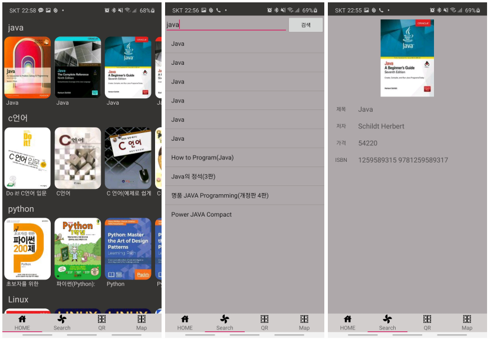

# Book search

* OPEN API(kakao search API)를 이용하여 keyword를 통해 책 정보를 받아와 데이터를 출력 해주는 어플입니다.

## 사용 기술

* [Fragment](https://github.com/hyunho058/TIL/blob/master/AndroidTIL/Fragment.md)

* [RecyclerView](https://github.com/hyunho058/TIL/blob/master/AndroidTIL/RecyclerVIew.md)
* [TabLayout](https://github.com/hyunho058/TIL/blob/master/AndroidTIL/TabLayout.md)
* [Asyctask](https://github.com/hyunho058/TIL/blob/master/AndroidTIL/AsyncTask.md)
* [REST API](https://github.com/hyunho058/TIL/blob/master/AndroidTIL/REST_API.md)
  * JSON Object
  * [RETROFIT2](https://github.com/hyunho058/TIL/blob/master/AndroidTIL/RETROFIT2.md)
* [Debounce](https://github.com/hyunho058/TIL/blob/master/AndroidTIL/Debounce.md)
* [Glide](https://github.com/hyunho058/TIL/blob/master/AndroidTIL/Glide.md)
* [Zxing](https://github.com/hyunho058/TIL/blob/master/AndroidTIL/Zxing.md)

## Image

